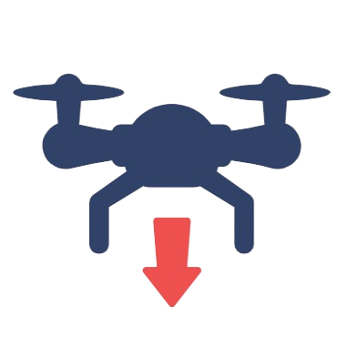

# DJI Drone Autopilot Android Application

An advanced Android-based application built for autonomous DJI drone control, incorporating waypoint navigation, people detection, voice commands, and hands-free operation. Developed with the DJI Mobile SDK 4, OpenCV, and YOLOv7 for robust, real-time functionality, this app is designed for use in applications such as surveillance, search-and-rescue, and waypoint missions.

---

### Functionalities

-  **Return to Home**: Automatically navigates the drone back to the takeoff point.
-  **Take Off**: Commands the drone to ascend to a hovering altitude automatically.
-  **Stop**:Instantly stops any ongoing operations for safety.
-  **Land**: Automates landing at the current location.
-  **Go To**: Navigates to the first added waypoint.
-  **Follow Me**: Uses GPS to track and follow the Android device that controls it.
-  **Add Waypoint**: Add a waypoint to the mission.
-  **Remove Waypoint**: Delete the last waypoint.
-  **Repeat Route**: Executes navigation through all added waypoints.
-  **Virtual Stick**: Enables manual control for the drone.
-  **Start Recording**: Begins video recording.
-  **Stop Recording**: Stops and saves video.
-  **Camera Adjust**: Accesses controls for adjusting camera angle.
-  **Detect People**: Toggles people detection on or off.
-  **Map Resize**: Expands or minimizes the map.
-  **Map Center**: Centers map on the drone’s current position.
- **Voice Commands**: Allows hands-free control by using the wake word "Rexy" and commands like "Takeoff" or "Go To."

---

### Go-To Algorithm
This algorithm directs the drone to a waypoint using virtual sticks:
1. **Enable Virtual Stick Mode**: Allows control through software commands.
2. **Retrieve Waypoint Coordinates**: Fetches the destination’s latitude, longitude, and altitude.
3. **Continuous Navigation**: Uses `sendVirtualStickFlightControlData()` to guide the drone toward the target, adjusting direction dynamically with `calculateBearing()` until arrival.

### Follow Me Feature
The drone follows the user’s Android device by continuously retrieving GPS coordinates, keeping it within a set distance of the device. This feature is useful for dynamic tasks such as filming.

### Pre-Planned and Real-Time Navigation
Combines pre-planned missions (following a sequence of waypoints) with the ability to add waypoints in real-time. The Repeat Route feature re-navigates through all previous waypoints and returns to the initial point.

### Voice Command Integration
Uses Android’s speech recognition to detect a wake word and execute specific commands, enhancing hands-free operation in situations where manual control may be impractical.

### People Detection
Uses YOLOv7 to detect and count people within the camera’s view.

### Data Logging
Two folders store essential data on the Android device:
- **DJI_Drone_Logs**: Logs comprehensive flight telemetry data (e.g., battery, speed, position).
- **Waypoints**: Saves all waypoints added during the session with timestamped GPS data.

## CSV File Management
- **DJI_Drone_Logs**: Saves real-time telemetry data in CSV files.
- **Waypoints Folder**: Logs all waypoints with timestamps, supporting mission planning and navigation history.

---
## Getting Started

### Prerequisites
- **Android Studio** (tested on Android Studio Koala | 2024.1.1 Patch 2)
- **OpenCV 4.10.0**
- **YOLOv7-tiny.weights**

### Installation Guide

1. **Download and Extract** the latest release of the application files.
2. **Open Android Studio** and import the `DJI_Mobile_SDK_Android_V4-2.0.0` project.
3. **Set Up Gradle**:
   - Gradle JDK version: 15.0.2 (`Settings` -> `Build, Execution, Deployment` -> `Build Tools` -> `Gradle`).
   - Gradle Version: 6.7.1, Android Gradle Plugin Version: 4.2.2 (`Project Structure` -> `Project`).
4. **Install OpenCV 4.10.0**:
   - Download from [OpenCV releases](https://github.com/opencv/opencv/releases/download/4.10.0/opencv-4.10.0-android-sdk.zip).
   - Import OpenCV as a module: `File` -> `New` -> `Import Module` -> locate the OpenCV SDK -> `Ok`.
   - Rename the module to "OpenCV" and complete the import, if you had an issue naming it as "OpenCV" change the name, or you may delete the existing OpenCV file.
   - If import errors occur, navigate to `build.gradle (Module: openCV)` and add the OpenCV build configuration from [this file](https://github.com/Malak47/DJI_Mobile_SDK_Android_V4/blob/fc803ec79002155ce2565655bd0657ff4d6b4b1d/OpenCV_build_temp.gradle).
5. **Add Dependencies**:
   - Go to `Project Structure` -> `Dependencies`.
   - Under `Modules`, select `<All Modules>`, add a Module Dependency for `app`, then check OpenCV.
6. **Set up YOLOv7-tiny.weights**:
   - Download `yolov7-tiny.weights` from [this link](https://github.com/AlexeyAB/darknet/releases/download/yolov4/yolov7-tiny.weights).
   - Add the file to the `assets` folder within your project.

### Running the Application

1. Connect your Android device via USB.
2. Ensure USB Debugging is enabled on the device.
3. Launch the application from Android Studio by selecting `Run`.
4. The app will load on your device with the main page layout.
5. Turn on your drone and your controller connected to the Android device.
6. Click on `Register APP` button, and wait until the `Open` button turns blue, that means the drone is connected to the RC.
7. Click on `Open`, a list of interfaces will show up, under `ILM Remote Controller` interface click on `Mobile Remote Controller`
